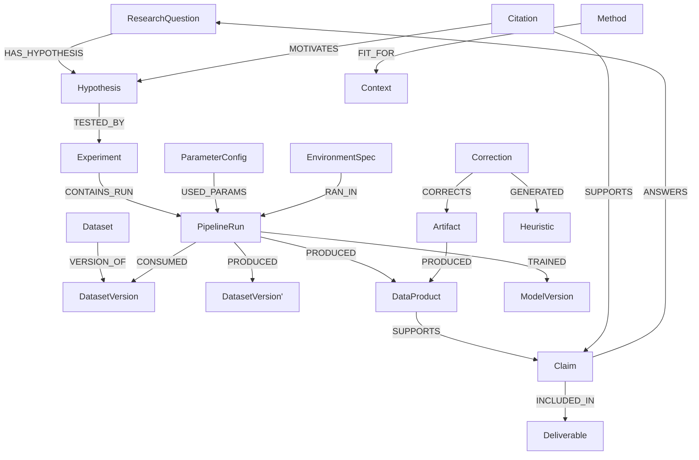

# Seldon Schema Design

**Version:** 1.0
**Date:** 2026-03-08
**Status:** Draft — pending human review before implementation
**Author:** Generated by Claude Code from CC Task `2026-02-20_schema-design-doc.md`

---

## Table of Contents

1. [Purpose & Scope](#1-purpose--scope)
2. [Design Principles](#2-design-principles)
3. [Tier Strategy](#3-tier-strategy)
4. [Postgres Schema](#4-postgres-schema)
5. [Neo4j Schema](#5-neo4j-schema)
6. [Lineage Model](#6-lineage-model)
7. [CLI Interface Contract](#7-cli-interface-contract)
8. [Skill Integration Points](#8-skill-integration-points)
9. [Open Questions](#9-open-questions)
10. [Tier Implementation Checklist](#10-tier-implementation-checklist)

---

## 1. Purpose & Scope

This document defines the complete database schema for the Seldon research operating system. Seldon provides per-project artifact traceability, result provenance, task tracking, and session continuity for AI-assisted scientific and engineering work.

### What This Document Covers

- Postgres relational schema (structured facts, queryable records)
- Neo4j graph schema (relationships, traceability, lineage)
- Full four-tier entity inventory spanning all nine entity layers
- CLI interface contract (command signatures, not implementation)
- Skill integration mapping for all seven specialist roles
- Migration naming conventions and tier promotion criteria

### What This Document Does Not Cover

- Implementation code (Python package scaffold is CC Task 2)
- Migration scripts (defined here as interface, implemented in CC Task 2–3)
- MCP server (explicitly deferred — CLI-first architecture; MCP is future-tier for external consumer access only)
- Wintermute integration (shelved; may reconnect as meta-layer in future)
- Cross-project queries (future-tier via Wintermute meta-layer)

### Related Documents

- `docs/design/` — Agent team design spec (fractal specialist roles)
- `docs/requirements/` — System requirements
- `docs/decisions/` — Architecture decision records

---

### Architectural Clarification: Seldon vs. Wintermute Storage

> **IMPORTANT — Read before implementing CC Task 2.**

This document was drafted with Postgres + Neo4j as Seldon's internal storage engine. That is **incorrect for Seldon**. The correct separation is:

| System | Internal Storage | Rationale |
|--------|-----------------|----------|
| **Seldon** | NetworkX + JSONL (event-sourced, append-only log) | Lives inside the project repo. Zero infrastructure dependency. Fully portable. Works inside Census walls, on a laptop, anywhere Python runs. The entire project state is a directory of files. |
| **Wintermute** | Neo4j + Postgres (persistent services) | Cross-domain knowledge layer. Grows over time. Requires running services. Lives on your Mac, not inside project repos. |

**The Postgres + Neo4j schema defined in this document describes the Wintermute integration target** — what Seldon projects export to when feeding the cross-domain knowledge layer, not Seldon's own internal storage.

**For CC Task 2 (Python package scaffold), the implementation target is:**
- Event store: append-only JSONL file (`seldon_events.jsonl` in project root)
- Graph projection: NetworkX, rebuilt from event replay at session start
- No running database services required
- `seldon init` creates a project directory structure and empty event log, not a Postgres database

The Postgres + Neo4j schema in sections 4–5 remains valid as the **Wintermute export schema** and future integration target. Do not implement it as Seldon's internal storage.

---

## 2. Design Principles

### P1 — No MCP Server (Now)

Seldon is a Python package with CLI entry points that Claude Code invokes via Bash. MCP is reserved for future external consumer access. This avoids the isolation and clutter problems encountered with prior Wintermute/Arnold integrations.

### P2 — Skills Are Thin Pointers

Skill files define *when* to activate and *what CLI commands to run*. Actual domain knowledge lives in the database, queried on demand. Skills do not embed schema knowledge; they reference CLI commands that return it.

### P3 — Always-On vs. On-Call Specialists

Lead / Chief Scientist and Documentation specialists are always-on. The remaining five specialist roles are on-call, activated when the current work phase demands them. Specialists are never concurrent — one active at a time per phase.

### P4 — Full Reproducibility Is Non-Negotiable

ML ops patterns, simulation tracking, environment specs, and full data lineage are designed into the schema from day one. Implementation is tiered; the schema is not. Every entity that could affect reproducibility carries the fields needed to reconstruct it.

### P5 — Tiered Implementation, Not Tiered Design

All four tiers are specified in this document. Each tier is implemented as a module: new migration scripts + new CLI commands + skill updates. No redesign of existing schema. Adding a tier should feel like `pip install seldon[tier2]` even though it is migration scripts under the hood.

### P6 — Postgres for Facts, Neo4j for Relationships

Postgres stores structured, queryable facts about entities (what a dataset is, when a run happened, what parameters were used). Neo4j stores relationships and traceability (what produced what, what supports what, what contradicts what). Same separation as Arnold project.

### P7 — Per-Project Database Isolation

`seldon init <project-name>` creates a dedicated Postgres database (`seldon_<project_name>`) and a dedicated Neo4j database (or project-scoped graph space). Each project is fully isolated — same schema, different instance. No cross-project bleed-through. Cross-project queries are future-tier.

### P8 — Project YAML Is the Project Identity

Each Seldon project has a `seldon.yaml` config file specifying the project path, database connections, active tier, agent roster, and project-specific rules. `seldon init` generates this from a template. This is the entry point for all CLI commands.

### P9 — Risk-Stratified Authority Model

Default is auto-accept — no blanket approval gates. Human review is triggered automatically based on a risk score derived from:

- **Graph position** — number of downstream dependents in the lineage graph
- **Artifact type** — Results > Scripts > DataFiles for citation risk
- **State transition** — any transition to `published` is always elevated
- **Provenance completeness** — gaps in `computed_from` / `generated_by` chains are flagged

All `artifacts`, `data_products`, and `deliverables` carry `risk_score` and `review_required` fields. All state transitions log to `state_transition_log` with the triggering risk factors.

---

## 3. Tier Strategy

### Tier Definitions

| Tier | Name | Trigger |
|------|------|---------|
| 1 | MVP — Project Kickoff | `seldon init` — enough to start and track a research project |
| 2 | Pipeline Execution | First data processing / pipeline run in the project |
| 3 | Evaluation | First results that need systematic assessment |
| 4 | Governance | External review, compliance, or institutional publishing |

### Promotion Criteria

- **Tier 1 → 2:** Project has at least one registered dataset and one defined experiment.
- **Tier 2 → 3:** At least one pipeline run has completed with a logged output.
- **Tier 3 → 4:** A deliverable has been flagged for external review or `published` state is requested.

Promotion is explicit, not automatic. `seldon tier promote --to 2` validates preconditions and applies the migration batch.

### Migration Naming Convention

```
migrations/
  001_tier1_projects.sql
  002_tier1_research_questions.sql
  003_tier1_hypotheses.sql
  004_tier1_datasets.sql
  005_tier1_citations.sql
  006_tier1_artifacts.sql
  007_tier1_data_products.sql
  008_tier1_deliverables.sql
  009_tier1_corrections.sql
  010_tier1_journal_entries.sql
  011_tier1_state_transition_log.sql
  101_tier2_experiments.sql
  102_tier2_pipeline_runs.sql
  103_tier2_parameter_configs.sql
  104_tier2_environment_specs.sql
  105_tier2_dataset_versions.sql
  106_tier2_data_lineage.sql
  201_tier3_evaluation_metrics.sql
  202_tier3_validation_protocols.sql
  203_tier3_statistical_results.sql
  204_tier3_error_analyses.sql
  205_tier3_models.sql
  206_tier3_model_versions.sql
  301_tier4_decisions.sql
  302_tier4_review_records.sql
  303_tier4_issues.sql
  304_tier4_access_controls.sql
  305_tier4_compliance_metadata.sql
```

Migrations within a tier are applied as a batch. Rollback scripts are named `NNN_tier<T>_<entity>_rollback.sql`.

---

## 4. Postgres Schema

> All tables include `id UUID PRIMARY KEY DEFAULT gen_random_uuid()`, `created_at TIMESTAMPTZ DEFAULT now()`, and `updated_at TIMESTAMPTZ DEFAULT now()` unless otherwise noted.

### 4.1 Tier 1 Tables

#### `projects` [Tier 1]

The root entity. Every other table references this via `project_id`.

```sql
-- Migration: 001_tier1_projects.sql
CREATE TABLE projects (
    id              UUID PRIMARY KEY DEFAULT gen_random_uuid(),
    name            TEXT NOT NULL UNIQUE,           -- slug used in DB name: seldon_<name>
    display_name    TEXT NOT NULL,
    description     TEXT,
    domain          TEXT,                           -- e.g., 'genomics', 'nlp', 'sas_conversion'
    active_tier     SMALLINT NOT NULL DEFAULT 1 CHECK (active_tier BETWEEN 1 AND 4),
    status          TEXT NOT NULL DEFAULT 'active'
                        CHECK (status IN ('active', 'paused', 'archived', 'completed')),
    yaml_path       TEXT,                           -- absolute path to seldon.yaml
    created_at      TIMESTAMPTZ NOT NULL DEFAULT now(),
    updated_at      TIMESTAMPTZ NOT NULL DEFAULT now()
);

CREATE INDEX idx_projects_name ON projects(name);
CREATE INDEX idx_projects_status ON projects(status);
```

#### `research_questions` [Tier 1]

Scientific / Conceptual layer (Entity Layer 1).

```sql
-- Migration: 002_tier1_research_questions.sql
CREATE TABLE research_questions (
    id              UUID PRIMARY KEY DEFAULT gen_random_uuid(),
    project_id      UUID NOT NULL REFERENCES projects(id) ON DELETE CASCADE,
    text            TEXT NOT NULL,
    rationale       TEXT,
    status          TEXT NOT NULL DEFAULT 'open'
                        CHECK (status IN ('open', 'answered', 'retired', 'deferred')),
    parent_id       UUID REFERENCES research_questions(id),  -- for sub-questions
    created_at      TIMESTAMPTZ NOT NULL DEFAULT now(),
    updated_at      TIMESTAMPTZ NOT NULL DEFAULT now()
);

CREATE INDEX idx_rq_project ON research_questions(project_id);
CREATE INDEX idx_rq_status ON research_questions(status);
```

#### `hypotheses` [Tier 1]

Scientific / Conceptual layer (Entity Layer 1).

```sql
-- Migration: 003_tier1_hypotheses.sql
CREATE TABLE hypotheses (
    id                  UUID PRIMARY KEY DEFAULT gen_random_uuid(),
    project_id          UUID NOT NULL REFERENCES projects(id) ON DELETE CASCADE,
    research_question_id UUID REFERENCES research_questions(id),
    text                TEXT NOT NULL,
    rationale           TEXT,
    operationalization  TEXT,                        -- how this will be tested
    status              TEXT NOT NULL DEFAULT 'proposed'
                            CHECK (status IN ('proposed', 'testing', 'supported',
                                              'refuted', 'indeterminate', 'retired')),
    created_at          TIMESTAMPTZ NOT NULL DEFAULT now(),
    updated_at          TIMESTAMPTZ NOT NULL DEFAULT now()
);

CREATE INDEX idx_hyp_project ON hypotheses(project_id);
CREATE INDEX idx_hyp_rq ON hypotheses(research_question_id);
CREATE INDEX idx_hyp_status ON hypotheses(status);
```

#### `datasets` [Tier 1]

Data layer (Entity Layer 2) — basic registration. Full versioning is Tier 2.

```sql
-- Migration: 004_tier1_datasets.sql
CREATE TABLE datasets (
    id              UUID PRIMARY KEY DEFAULT gen_random_uuid(),
    project_id      UUID NOT NULL REFERENCES projects(id) ON DELETE CASCADE,
    name            TEXT NOT NULL,
    description     TEXT,
    source_uri      TEXT,                            -- URL, DOI, file path, or system identifier
    source_type     TEXT CHECK (source_type IN ('file', 'url', 'database', 'api',
                                                 'instrument', 'synthetic', 'derived')),
    version_tag     TEXT NOT NULL DEFAULT 'v1.0',
    format          TEXT,                            -- csv, parquet, hdf5, etc.
    schema_def      JSONB,                           -- column names/types if known
    record_count    BIGINT,
    size_bytes      BIGINT,
    content_hash    TEXT,                            -- SHA-256 of raw file(s)
    license         TEXT,
    access_level    TEXT NOT NULL DEFAULT 'project'
                        CHECK (access_level IN ('public', 'project', 'restricted')),
    status          TEXT NOT NULL DEFAULT 'registered'
                        CHECK (status IN ('registered', 'validated', 'deprecated')),
    notes           TEXT,
    created_at      TIMESTAMPTZ NOT NULL DEFAULT now(),
    updated_at      TIMESTAMPTZ NOT NULL DEFAULT now()
);

CREATE INDEX idx_datasets_project ON datasets(project_id);
CREATE INDEX idx_datasets_status ON datasets(status);
CREATE INDEX idx_datasets_content_hash ON datasets(content_hash);
```

#### `citations` [Tier 1]

Knowledge base / literature layer. Supports local copies. APA 7th edition metadata.

```sql
-- Migration: 005_tier1_citations.sql
CREATE TABLE citations (
    id              UUID PRIMARY KEY DEFAULT gen_random_uuid(),
    project_id      UUID NOT NULL REFERENCES projects(id) ON DELETE CASCADE,
    -- APA 7th edition fields
    authors         TEXT[] NOT NULL,                 -- ["Last, F. M.", "Last2, F."]
    year            SMALLINT,
    title           TEXT NOT NULL,
    publication     TEXT,                            -- journal, conference, book
    volume          TEXT,
    issue           TEXT,
    pages           TEXT,
    doi             TEXT UNIQUE,
    url             TEXT,
    -- Local storage
    local_path      TEXT,                            -- path to local PDF/copy
    content_hash    TEXT,                            -- hash of local copy
    -- Metadata
    citation_key    TEXT,                            -- e.g., "smith2023" for in-text use
    abstract        TEXT,
    keywords        TEXT[],
    notes           TEXT,
    status          TEXT NOT NULL DEFAULT 'active'
                        CHECK (status IN ('active', 'retracted', 'preprint', 'archived')),
    created_at      TIMESTAMPTZ NOT NULL DEFAULT now(),
    updated_at      TIMESTAMPTZ NOT NULL DEFAULT now()
);

CREATE INDEX idx_citations_project ON citations(project_id);
CREATE INDEX idx_citations_doi ON citations(doi);
CREATE INDEX idx_citations_citation_key ON citations(citation_key);
CREATE INDEX idx_citations_authors ON citations USING GIN(authors);
CREATE INDEX idx_citations_keywords ON citations USING GIN(keywords);
```

#### `artifacts` [Tier 1]

Code files, notebooks, docs — tracked with content hash. Risk-stratified. (Entity Layer 7)

```sql
-- Migration: 006_tier1_artifacts.sql
CREATE TABLE artifacts (
    id              UUID PRIMARY KEY DEFAULT gen_random_uuid(),
    project_id      UUID NOT NULL REFERENCES projects(id) ON DELETE CASCADE,
    name            TEXT NOT NULL,
    artifact_type   TEXT NOT NULL
                        CHECK (artifact_type IN ('code', 'notebook', 'script', 'config',
                                                  'documentation', 'schema', 'other')),
    file_path       TEXT NOT NULL,                   -- relative to project root
    content_hash    TEXT NOT NULL,                   -- SHA-256
    version_tag     TEXT NOT NULL DEFAULT 'v1.0',
    description     TEXT,
    language        TEXT,                            -- python, r, sql, etc.
    status          TEXT NOT NULL DEFAULT 'draft'
                        CHECK (status IN ('draft', 'review', 'approved', 'published',
                                          'deprecated', 'archived')),
    -- Risk stratification (P9)
    risk_score      NUMERIC(4,3) DEFAULT 0.0 CHECK (risk_score BETWEEN 0 AND 1),
    review_required BOOLEAN NOT NULL DEFAULT FALSE,
    risk_factors    JSONB,                           -- which P9 factors triggered
    -- Provenance
    generated_by    TEXT,                            -- CLI command, agent role, or user
    created_at      TIMESTAMPTZ NOT NULL DEFAULT now(),
    updated_at      TIMESTAMPTZ NOT NULL DEFAULT now()
);

CREATE INDEX idx_artifacts_project ON artifacts(project_id);
CREATE INDEX idx_artifacts_type ON artifacts(artifact_type);
CREATE INDEX idx_artifacts_hash ON artifacts(content_hash);
CREATE INDEX idx_artifacts_status ON artifacts(status);
CREATE INDEX idx_artifacts_review ON artifacts(review_required) WHERE review_required = TRUE;
```

#### `data_products` [Tier 1]

Tables, figures, CSVs — outputs of analysis. (Entity Layer 6)

```sql
-- Migration: 007_tier1_data_products.sql
CREATE TABLE data_products (
    id              UUID PRIMARY KEY DEFAULT gen_random_uuid(),
    project_id      UUID NOT NULL REFERENCES projects(id) ON DELETE CASCADE,
    name            TEXT NOT NULL,
    product_type    TEXT NOT NULL
                        CHECK (product_type IN ('table', 'figure', 'csv', 'json',
                                                 'plot', 'summary', 'other')),
    file_path       TEXT,
    content_hash    TEXT,
    description     TEXT,
    status          TEXT NOT NULL DEFAULT 'draft'
                        CHECK (status IN ('draft', 'review', 'approved', 'published',
                                          'superseded', 'retracted')),
    -- Risk stratification (P9)
    risk_score      NUMERIC(4,3) DEFAULT 0.0 CHECK (risk_score BETWEEN 0 AND 1),
    review_required BOOLEAN NOT NULL DEFAULT FALSE,
    risk_factors    JSONB,
    -- Provenance
    computed_from   UUID[],                          -- artifact or dataset UUIDs
    generated_by    TEXT,
    notes           TEXT,
    created_at      TIMESTAMPTZ NOT NULL DEFAULT now(),
    updated_at      TIMESTAMPTZ NOT NULL DEFAULT now()
);

CREATE INDEX idx_dp_project ON data_products(project_id);
CREATE INDEX idx_dp_type ON data_products(product_type);
CREATE INDEX idx_dp_status ON data_products(status);
CREATE INDEX idx_dp_review ON data_products(review_required) WHERE review_required = TRUE;
```

#### `deliverables` [Tier 1]

Reports, slides, papers — final outputs. (Entity Layer 6)

```sql
-- Migration: 008_tier1_deliverables.sql
CREATE TABLE deliverables (
    id                  UUID PRIMARY KEY DEFAULT gen_random_uuid(),
    project_id          UUID NOT NULL REFERENCES projects(id) ON DELETE CASCADE,
    name                TEXT NOT NULL,
    deliverable_type    TEXT NOT NULL
                            CHECK (deliverable_type IN ('report', 'paper', 'slides',
                                                         'fact_sheet', 'dashboard',
                                                         'memo', 'other')),
    file_path           TEXT,
    content_hash        TEXT,
    description         TEXT,
    status              TEXT NOT NULL DEFAULT 'draft'
                            CHECK (status IN ('draft', 'review', 'approved',
                                              'published', 'archived')),
    target_audience     TEXT,
    -- Risk stratification (P9) — always elevated at published
    risk_score          NUMERIC(4,3) DEFAULT 0.0 CHECK (risk_score BETWEEN 0 AND 1),
    review_required     BOOLEAN NOT NULL DEFAULT FALSE,
    risk_factors        JSONB,
    -- Provenance
    includes_products   UUID[],                      -- data_product UUIDs included
    generated_by        TEXT,
    notes               TEXT,
    created_at          TIMESTAMPTZ NOT NULL DEFAULT now(),
    updated_at          TIMESTAMPTZ NOT NULL DEFAULT now()
);

CREATE INDEX idx_del_project ON deliverables(project_id);
CREATE INDEX idx_del_type ON deliverables(deliverable_type);
CREATE INDEX idx_del_status ON deliverables(status);
CREATE INDEX idx_del_review ON deliverables(review_required) WHERE review_required = TRUE;
```

#### `corrections` [Tier 1]

Expert feedback: what was wrong, why, and how to fix it. Seeds the pragmatics graph. (Entity Layer 8)

```sql
-- Migration: 009_tier1_corrections.sql
CREATE TABLE corrections (
    id              UUID PRIMARY KEY DEFAULT gen_random_uuid(),
    project_id      UUID NOT NULL REFERENCES projects(id) ON DELETE CASCADE,
    -- What was corrected
    target_type     TEXT NOT NULL
                        CHECK (target_type IN ('artifact', 'data_product', 'deliverable',
                                               'hypothesis', 'dataset', 'pipeline_run',
                                               'model', 'claim', 'other')),
    target_id       UUID NOT NULL,                   -- FK to whichever table target_type points to
    -- Correction content
    what            TEXT NOT NULL,                   -- description of the error
    why             TEXT NOT NULL,                   -- root cause
    fix             TEXT NOT NULL,                   -- corrective action taken or recommended
    severity        TEXT NOT NULL DEFAULT 'minor'
                        CHECK (severity IN ('minor', 'moderate', 'major', 'critical')),
    correction_type TEXT
                        CHECK (correction_type IN ('factual', 'methodological', 'statistical',
                                                   'citation', 'code', 'reproducibility', 'other')),
    -- Resolution
    status          TEXT NOT NULL DEFAULT 'open'
                        CHECK (status IN ('open', 'in_progress', 'resolved', 'wont_fix')),
    resolved_at     TIMESTAMPTZ,
    -- Pragmatics graph seed (Neo4j will create Method → GENERATED → Correction → GENERATED → Heuristic)
    heuristic_text  TEXT,                            -- distilled lesson learned
    applies_to      TEXT[],                          -- domain contexts where heuristic applies
    -- Attribution
    raised_by       TEXT,                            -- agent role or 'human'
    created_at      TIMESTAMPTZ NOT NULL DEFAULT now(),
    updated_at      TIMESTAMPTZ NOT NULL DEFAULT now()
);

CREATE INDEX idx_cor_project ON corrections(project_id);
CREATE INDEX idx_cor_target ON corrections(target_type, target_id);
CREATE INDEX idx_cor_status ON corrections(status);
CREATE INDEX idx_cor_severity ON corrections(severity);
```

#### `journal_entries` [Tier 1]

Lab notebook entries — session continuity, decision rationale, observations.

```sql
-- Migration: 010_tier1_journal_entries.sql
CREATE TABLE journal_entries (
    id              UUID PRIMARY KEY DEFAULT gen_random_uuid(),
    project_id      UUID NOT NULL REFERENCES projects(id) ON DELETE CASCADE,
    entry_date      DATE NOT NULL DEFAULT CURRENT_DATE,
    title           TEXT NOT NULL,
    content         TEXT NOT NULL,                   -- markdown body
    entry_type      TEXT NOT NULL DEFAULT 'session_note'
                        CHECK (entry_type IN ('session_note', 'decision', 'observation',
                                              'milestone', 'hypothesis_update',
                                              'correction_log', 'handoff')),
    -- References to other entities (loose coupling via JSONB)
    referenced_entities JSONB,                      -- [{"type": "dataset", "id": "..."}]
    tags            TEXT[],
    author          TEXT,                            -- agent role or human name
    created_at      TIMESTAMPTZ NOT NULL DEFAULT now(),
    updated_at      TIMESTAMPTZ NOT NULL DEFAULT now()
);

CREATE INDEX idx_je_project ON journal_entries(project_id);
CREATE INDEX idx_je_date ON journal_entries(entry_date);
CREATE INDEX idx_je_type ON journal_entries(entry_type);
CREATE INDEX idx_je_tags ON journal_entries USING GIN(tags);
CREATE INDEX idx_je_content_fts ON journal_entries USING GIN(to_tsvector('english', content));
```

#### `state_transition_log` [Tier 1]

Audit log for all status changes on risk-stratified entities. (Entity Layer 8)

```sql
-- Migration: 011_tier1_state_transition_log.sql
CREATE TABLE state_transition_log (
    id              UUID PRIMARY KEY DEFAULT gen_random_uuid(),
    project_id      UUID NOT NULL REFERENCES projects(id) ON DELETE CASCADE,
    entity_type     TEXT NOT NULL,
    entity_id       UUID NOT NULL,
    from_state      TEXT,
    to_state        TEXT NOT NULL,
    -- Risk assessment at time of transition
    risk_score      NUMERIC(4,3),
    review_required BOOLEAN NOT NULL DEFAULT FALSE,
    risk_factors    JSONB,
    -- Attribution
    triggered_by    TEXT NOT NULL,                   -- agent role, CLI command, or 'human'
    rationale       TEXT,
    created_at      TIMESTAMPTZ NOT NULL DEFAULT now()
    -- No updated_at — log is append-only
);

CREATE INDEX idx_stl_project ON state_transition_log(project_id);
CREATE INDEX idx_stl_entity ON state_transition_log(entity_type, entity_id);
CREATE INDEX idx_stl_review ON state_transition_log(review_required) WHERE review_required = TRUE;
CREATE INDEX idx_stl_created ON state_transition_log(created_at);
```

---

### 4.2 Tier 2 Tables

#### `experiments` [Tier 2]

Logical grouping linking hypothesis → runs → results. (Entity Layer 3)

```sql
-- Migration: 101_tier2_experiments.sql
CREATE TABLE experiments (
    id              UUID PRIMARY KEY DEFAULT gen_random_uuid(),
    project_id      UUID NOT NULL REFERENCES projects(id) ON DELETE CASCADE,
    hypothesis_id   UUID REFERENCES hypotheses(id),
    name            TEXT NOT NULL,
    description     TEXT,
    design          TEXT,                            -- experimental design description
    status          TEXT NOT NULL DEFAULT 'planned'
                        CHECK (status IN ('planned', 'running', 'completed',
                                          'failed', 'cancelled', 'archived')),
    started_at      TIMESTAMPTZ,
    completed_at    TIMESTAMPTZ,
    created_at      TIMESTAMPTZ NOT NULL DEFAULT now(),
    updated_at      TIMESTAMPTZ NOT NULL DEFAULT now()
);

CREATE INDEX idx_exp_project ON experiments(project_id);
CREATE INDEX idx_exp_hypothesis ON experiments(hypothesis_id);
CREATE INDEX idx_exp_status ON experiments(status);
```

#### `pipeline_runs` [Tier 2]

Execution record: what, when, params, environment. (Entity Layer 3)

```sql
-- Migration: 102_tier2_pipeline_runs.sql
CREATE TABLE pipeline_runs (
    id                  UUID PRIMARY KEY DEFAULT gen_random_uuid(),
    project_id          UUID NOT NULL REFERENCES projects(id) ON DELETE CASCADE,
    experiment_id       UUID REFERENCES experiments(id),
    name                TEXT NOT NULL,
    run_type            TEXT NOT NULL
                            CHECK (run_type IN ('preprocessing', 'training', 'inference',
                                               'evaluation', 'etl', 'simulation', 'other')),
    -- Execution details
    parameter_config_id UUID,                        -- FK added after 103 migration
    environment_spec_id UUID,                        -- FK added after 104 migration
    command             TEXT NOT NULL,               -- exact command or DAG name run
    random_seed         BIGINT,
    status              TEXT NOT NULL DEFAULT 'queued'
                            CHECK (status IN ('queued', 'running', 'completed',
                                             'failed', 'cancelled')),
    exit_code           INTEGER,
    started_at          TIMESTAMPTZ,
    completed_at        TIMESTAMPTZ,
    duration_seconds    NUMERIC(12,3),
    log_path            TEXT,                        -- path to stdout/stderr log
    error_message       TEXT,
    -- Risk stratification
    risk_score          NUMERIC(4,3) DEFAULT 0.0,
    review_required     BOOLEAN NOT NULL DEFAULT FALSE,
    risk_factors        JSONB,
    created_at          TIMESTAMPTZ NOT NULL DEFAULT now(),
    updated_at          TIMESTAMPTZ NOT NULL DEFAULT now()
);

CREATE INDEX idx_pr_project ON pipeline_runs(project_id);
CREATE INDEX idx_pr_experiment ON pipeline_runs(experiment_id);
CREATE INDEX idx_pr_status ON pipeline_runs(status);
CREATE INDEX idx_pr_started ON pipeline_runs(started_at);
```

#### `parameter_configs` [Tier 2]

Hyperparameters, preprocessing settings, random seeds. (Entity Layer 3)

```sql
-- Migration: 103_tier2_parameter_configs.sql
CREATE TABLE parameter_configs (
    id              UUID PRIMARY KEY DEFAULT gen_random_uuid(),
    project_id      UUID NOT NULL REFERENCES projects(id) ON DELETE CASCADE,
    name            TEXT NOT NULL,
    description     TEXT,
    config          JSONB NOT NULL,                  -- full parameter set as key-value pairs
    config_hash     TEXT NOT NULL,                   -- SHA-256 of canonical JSON
    version_tag     TEXT NOT NULL DEFAULT 'v1.0',
    created_at      TIMESTAMPTZ NOT NULL DEFAULT now(),
    updated_at      TIMESTAMPTZ NOT NULL DEFAULT now()
);

-- Now add FK constraints to pipeline_runs
ALTER TABLE pipeline_runs
    ADD CONSTRAINT fk_pr_param_config
    FOREIGN KEY (parameter_config_id) REFERENCES parameter_configs(id);

CREATE INDEX idx_pc_project ON parameter_configs(project_id);
CREATE INDEX idx_pc_hash ON parameter_configs(config_hash);
CREATE INDEX idx_pc_config ON parameter_configs USING GIN(config);
```

#### `environment_specs` [Tier 2]

Hardware, container, OS, library versions, hashes. (Entity Layer 3)

```sql
-- Migration: 104_tier2_environment_specs.sql
CREATE TABLE environment_specs (
    id              UUID PRIMARY KEY DEFAULT gen_random_uuid(),
    project_id      UUID NOT NULL REFERENCES projects(id) ON DELETE CASCADE,
    name            TEXT NOT NULL,
    description     TEXT,
    -- Environment identity
    os              TEXT,                            -- e.g., "Ubuntu 22.04.3 LTS"
    python_version  TEXT,
    container_image TEXT,                            -- Docker image + tag
    container_hash  TEXT,                            -- image digest SHA256
    hardware        JSONB,                           -- {"cpu": "...", "gpu": "...", "ram_gb": 64}
    -- Package environment
    packages        JSONB,                           -- {"numpy": "1.24.3", ...}
    env_hash        TEXT NOT NULL,                   -- SHA-256 of canonical env spec
    -- Lockfile paths
    requirements_path TEXT,
    conda_env_path  TEXT,
    created_at      TIMESTAMPTZ NOT NULL DEFAULT now(),
    updated_at      TIMESTAMPTZ NOT NULL DEFAULT now()
);

-- Now add FK constraint to pipeline_runs
ALTER TABLE pipeline_runs
    ADD CONSTRAINT fk_pr_env_spec
    FOREIGN KEY (environment_spec_id) REFERENCES environment_specs(id);

CREATE INDEX idx_es_project ON environment_specs(project_id);
CREATE INDEX idx_es_hash ON environment_specs(env_hash);
```

#### `dataset_versions` [Tier 2]

Snapshot tracking — transforms producing derived datasets. (Entity Layer 2)

```sql
-- Migration: 105_tier2_dataset_versions.sql
CREATE TABLE dataset_versions (
    id              UUID PRIMARY KEY DEFAULT gen_random_uuid(),
    project_id      UUID NOT NULL REFERENCES projects(id) ON DELETE CASCADE,
    dataset_id      UUID NOT NULL REFERENCES datasets(id) ON DELETE CASCADE,
    version_tag     TEXT NOT NULL,
    description     TEXT,
    -- How this version was produced
    derived_from_id UUID REFERENCES dataset_versions(id),  -- NULL = original
    transform_desc  TEXT,                            -- description of transform applied
    pipeline_run_id UUID REFERENCES pipeline_runs(id),
    -- Content
    file_path       TEXT,
    content_hash    TEXT NOT NULL,
    record_count    BIGINT,
    size_bytes      BIGINT,
    schema_def      JSONB,
    quality_report  JSONB,                           -- data quality metrics
    created_at      TIMESTAMPTZ NOT NULL DEFAULT now(),
    UNIQUE (dataset_id, version_tag)
);

CREATE INDEX idx_dv_dataset ON dataset_versions(dataset_id);
CREATE INDEX idx_dv_hash ON dataset_versions(content_hash);
CREATE INDEX idx_dv_run ON dataset_versions(pipeline_run_id);
```

#### `data_lineage` [Tier 2]

Transformation nodes linking datasets. Flat-table complement to Neo4j lineage graph. (Entity Layer 7)

```sql
-- Migration: 106_tier2_data_lineage.sql
CREATE TABLE data_lineage (
    id              UUID PRIMARY KEY DEFAULT gen_random_uuid(),
    project_id      UUID NOT NULL REFERENCES projects(id) ON DELETE CASCADE,
    -- Source
    source_type     TEXT NOT NULL
                        CHECK (source_type IN ('dataset_version', 'data_product',
                                               'pipeline_run', 'artifact')),
    source_id       UUID NOT NULL,
    -- Target
    target_type     TEXT NOT NULL
                        CHECK (target_type IN ('dataset_version', 'data_product',
                                               'pipeline_run', 'artifact')),
    target_id       UUID NOT NULL,
    -- Relationship
    relationship    TEXT NOT NULL
                        CHECK (relationship IN ('produced', 'consumed', 'transformed',
                                               'derived_from', 'validated_by')),
    pipeline_run_id UUID REFERENCES pipeline_runs(id),
    notes           TEXT,
    created_at      TIMESTAMPTZ NOT NULL DEFAULT now()
);

CREATE INDEX idx_dl_project ON data_lineage(project_id);
CREATE INDEX idx_dl_source ON data_lineage(source_type, source_id);
CREATE INDEX idx_dl_target ON data_lineage(target_type, target_id);
CREATE INDEX idx_dl_run ON data_lineage(pipeline_run_id);
```

---

### 4.3 Tier 3 Tables

#### `evaluation_metrics` [Tier 3]

Per run/experiment metrics. (Entity Layer 5)

```sql
-- Migration: 201_tier3_evaluation_metrics.sql
CREATE TABLE evaluation_metrics (
    id                  UUID PRIMARY KEY DEFAULT gen_random_uuid(),
    project_id          UUID NOT NULL REFERENCES projects(id) ON DELETE CASCADE,
    experiment_id       UUID REFERENCES experiments(id),
    pipeline_run_id     UUID REFERENCES pipeline_runs(id),
    metric_name         TEXT NOT NULL,
    metric_value        NUMERIC,
    metric_value_text   TEXT,                        -- for non-numeric metrics
    metric_unit         TEXT,
    split               TEXT,                        -- train/val/test/holdout
    step                INTEGER,                     -- for learning curves / epochs
    notes               TEXT,
    created_at          TIMESTAMPTZ NOT NULL DEFAULT now()
);

CREATE INDEX idx_em_project ON evaluation_metrics(project_id);
CREATE INDEX idx_em_experiment ON evaluation_metrics(experiment_id);
CREATE INDEX idx_em_run ON evaluation_metrics(pipeline_run_id);
CREATE INDEX idx_em_name ON evaluation_metrics(metric_name);
```

#### `validation_protocols` [Tier 3]

CV folds, holdout definitions, validation methodology. (Entity Layer 5)

```sql
-- Migration: 202_tier3_validation_protocols.sql
CREATE TABLE validation_protocols (
    id              UUID PRIMARY KEY DEFAULT gen_random_uuid(),
    project_id      UUID NOT NULL REFERENCES projects(id) ON DELETE CASCADE,
    name            TEXT NOT NULL,
    description     TEXT,
    protocol_type   TEXT NOT NULL
                        CHECK (protocol_type IN ('cross_validation', 'holdout', 'bootstrap',
                                                  'train_test_split', 'time_series_split',
                                                  'custom')),
    config          JSONB NOT NULL,                  -- folds, ratios, random seeds, etc.
    rationale       TEXT,
    created_at      TIMESTAMPTZ NOT NULL DEFAULT now(),
    updated_at      TIMESTAMPTZ NOT NULL DEFAULT now()
);

CREATE INDEX idx_vp_project ON validation_protocols(project_id);
```

#### `statistical_results` [Tier 3]

Significance, confidence intervals, effect sizes. (Entity Layer 5)

```sql
-- Migration: 203_tier3_statistical_results.sql
CREATE TABLE statistical_results (
    id                      UUID PRIMARY KEY DEFAULT gen_random_uuid(),
    project_id              UUID NOT NULL REFERENCES projects(id) ON DELETE CASCADE,
    experiment_id           UUID REFERENCES experiments(id),
    hypothesis_id           UUID REFERENCES hypotheses(id),
    test_name               TEXT NOT NULL,           -- e.g., "Mann-Whitney U", "paired t-test"
    statistic_value         NUMERIC,
    p_value                 NUMERIC,
    confidence_level        NUMERIC DEFAULT 0.95,
    confidence_interval_low NUMERIC,
    confidence_interval_high NUMERIC,
    effect_size             NUMERIC,
    effect_size_type        TEXT,                    -- Cohen's d, eta², Hedges' g, etc.
    sample_size_n           INTEGER,
    interpretation          TEXT,
    supports_hypothesis     BOOLEAN,
    notes                   TEXT,
    created_at              TIMESTAMPTZ NOT NULL DEFAULT now()
);

CREATE INDEX idx_sr_project ON statistical_results(project_id);
CREATE INDEX idx_sr_experiment ON statistical_results(experiment_id);
CREATE INDEX idx_sr_hypothesis ON statistical_results(hypothesis_id);
```

#### `error_analyses` [Tier 3]

Systematic error characterization. (Entity Layer 5)

```sql
-- Migration: 204_tier3_error_analyses.sql
CREATE TABLE error_analyses (
    id              UUID PRIMARY KEY DEFAULT gen_random_uuid(),
    project_id      UUID NOT NULL REFERENCES projects(id) ON DELETE CASCADE,
    pipeline_run_id UUID REFERENCES pipeline_runs(id),
    experiment_id   UUID REFERENCES experiments(id),
    error_type      TEXT NOT NULL,
    description     TEXT NOT NULL,
    frequency       NUMERIC,                         -- rate or count
    severity        TEXT CHECK (severity IN ('low', 'medium', 'high', 'critical')),
    affected_slice  TEXT,                            -- data subset, subgroup, condition
    root_cause      TEXT,
    mitigation      TEXT,
    status          TEXT NOT NULL DEFAULT 'open'
                        CHECK (status IN ('open', 'mitigated', 'accepted', 'resolved')),
    created_at      TIMESTAMPTZ NOT NULL DEFAULT now(),
    updated_at      TIMESTAMPTZ NOT NULL DEFAULT now()
);

CREATE INDEX idx_ea_project ON error_analyses(project_id);
CREATE INDEX idx_ea_run ON error_analyses(pipeline_run_id);
```

#### `models` [Tier 3]

Method / model definitions (not trained weights — those are model_versions). (Entity Layer 4)

```sql
-- Migration: 205_tier3_models.sql
CREATE TABLE models (
    id              UUID PRIMARY KEY DEFAULT gen_random_uuid(),
    project_id      UUID NOT NULL REFERENCES projects(id) ON DELETE CASCADE,
    name            TEXT NOT NULL,
    model_type      TEXT NOT NULL
                        CHECK (model_type IN ('ml', 'statistical', 'simulation',
                                              'analytical', 'hybrid', 'other')),
    framework       TEXT,                            -- sklearn, pytorch, statsmodels, etc.
    architecture    TEXT,
    description     TEXT,
    status          TEXT NOT NULL DEFAULT 'experimental'
                        CHECK (status IN ('experimental', 'candidate', 'production',
                                          'retired')),
    created_at      TIMESTAMPTZ NOT NULL DEFAULT now(),
    updated_at      TIMESTAMPTZ NOT NULL DEFAULT now()
);

CREATE INDEX idx_mod_project ON models(project_id);
CREATE INDEX idx_mod_status ON models(status);
```

#### `model_versions` [Tier 3]

Trained weights, fitted objects, checkpoints. (Entity Layer 4)

```sql
-- Migration: 206_tier3_model_versions.sql
CREATE TABLE model_versions (
    id                  UUID PRIMARY KEY DEFAULT gen_random_uuid(),
    project_id          UUID NOT NULL REFERENCES projects(id) ON DELETE CASCADE,
    model_id            UUID NOT NULL REFERENCES models(id) ON DELETE CASCADE,
    version_tag         TEXT NOT NULL,
    pipeline_run_id     UUID REFERENCES pipeline_runs(id),   -- run that produced this version
    parameter_config_id UUID REFERENCES parameter_configs(id),
    -- Artifact
    artifact_path       TEXT,
    content_hash        TEXT,
    -- Evaluation summary (point-in-time snapshot; full metrics in evaluation_metrics)
    primary_metric      TEXT,
    primary_metric_value NUMERIC,
    -- Risk stratification
    risk_score          NUMERIC(4,3) DEFAULT 0.0,
    review_required     BOOLEAN NOT NULL DEFAULT FALSE,
    risk_factors        JSONB,
    status              TEXT NOT NULL DEFAULT 'candidate'
                            CHECK (status IN ('candidate', 'approved', 'production',
                                             'retired', 'retracted')),
    notes               TEXT,
    created_at          TIMESTAMPTZ NOT NULL DEFAULT now(),
    updated_at          TIMESTAMPTZ NOT NULL DEFAULT now(),
    UNIQUE (model_id, version_tag)
);

CREATE INDEX idx_mv_model ON model_versions(model_id);
CREATE INDEX idx_mv_run ON model_versions(pipeline_run_id);
CREATE INDEX idx_mv_status ON model_versions(status);
```

---

### 4.4 Tier 4 Tables

#### `decisions` [Tier 4]

Accept/reject hypothesis, model promotion, architectural choices. (Entity Layer 8)

```sql
-- Migration: 301_tier4_decisions.sql
CREATE TABLE decisions (
    id              UUID PRIMARY KEY DEFAULT gen_random_uuid(),
    project_id      UUID NOT NULL REFERENCES projects(id) ON DELETE CASCADE,
    title           TEXT NOT NULL,
    decision_type   TEXT NOT NULL
                        CHECK (decision_type IN ('hypothesis_accept', 'hypothesis_reject',
                                                  'model_promote', 'model_retire',
                                                  'methodology', 'architectural',
                                                  'data', 'other')),
    -- What was decided upon
    subject_type    TEXT,
    subject_id      UUID,
    -- Decision content
    decision        TEXT NOT NULL,
    rationale       TEXT NOT NULL,
    alternatives_considered TEXT,
    -- Review
    decided_by      TEXT NOT NULL,                  -- agent role or 'human'
    review_record_id UUID,                           -- FK added after 302 migration
    decided_at      TIMESTAMPTZ NOT NULL DEFAULT now(),
    effective_at    TIMESTAMPTZ,
    -- Status
    status          TEXT NOT NULL DEFAULT 'active'
                        CHECK (status IN ('active', 'superseded', 'reversed')),
    superseded_by   UUID REFERENCES decisions(id),
    created_at      TIMESTAMPTZ NOT NULL DEFAULT now(),
    updated_at      TIMESTAMPTZ NOT NULL DEFAULT now()
);

CREATE INDEX idx_dec_project ON decisions(project_id);
CREATE INDEX idx_dec_type ON decisions(decision_type);
CREATE INDEX idx_dec_subject ON decisions(subject_type, subject_id);
```

#### `review_records` [Tier 4]

Peer review, approvals, institutional sign-offs. (Entity Layer 8)

```sql
-- Migration: 302_tier4_review_records.sql
CREATE TABLE review_records (
    id              UUID PRIMARY KEY DEFAULT gen_random_uuid(),
    project_id      UUID NOT NULL REFERENCES projects(id) ON DELETE CASCADE,
    -- What is being reviewed
    subject_type    TEXT NOT NULL,
    subject_id      UUID NOT NULL,
    review_type     TEXT NOT NULL
                        CHECK (review_type IN ('internal', 'peer', 'institutional',
                                               'regulatory', 'client', 'other')),
    -- Review content
    reviewer        TEXT NOT NULL,
    outcome         TEXT CHECK (outcome IN ('approved', 'rejected', 'conditional',
                                            'revisions_required', 'pending')),
    comments        TEXT,
    conditions      TEXT,
    -- Risk assessment at review
    risk_score_at_review NUMERIC(4,3),
    -- Timing
    requested_at    TIMESTAMPTZ NOT NULL DEFAULT now(),
    completed_at    TIMESTAMPTZ,
    created_at      TIMESTAMPTZ NOT NULL DEFAULT now(),
    updated_at      TIMESTAMPTZ NOT NULL DEFAULT now()
);

-- Add FK from decisions
ALTER TABLE decisions
    ADD CONSTRAINT fk_dec_review
    FOREIGN KEY (review_record_id) REFERENCES review_records(id);

CREATE INDEX idx_rr_project ON review_records(project_id);
CREATE INDEX idx_rr_subject ON review_records(subject_type, subject_id);
CREATE INDEX idx_rr_outcome ON review_records(outcome);
```

#### `issues` [Tier 4]

Known limitations, open issues, technical debt. (Entity Layer 8)

```sql
-- Migration: 303_tier4_issues.sql
CREATE TABLE issues (
    id              UUID PRIMARY KEY DEFAULT gen_random_uuid(),
    project_id      UUID NOT NULL REFERENCES projects(id) ON DELETE CASCADE,
    title           TEXT NOT NULL,
    issue_type      TEXT NOT NULL
                        CHECK (issue_type IN ('limitation', 'bug', 'data_quality',
                                              'reproducibility', 'bias', 'scope',
                                              'technical_debt', 'other')),
    description     TEXT NOT NULL,
    severity        TEXT NOT NULL DEFAULT 'minor'
                        CHECK (severity IN ('minor', 'moderate', 'major', 'critical')),
    -- Subject
    subject_type    TEXT,
    subject_id      UUID,
    -- Resolution
    status          TEXT NOT NULL DEFAULT 'open'
                        CHECK (status IN ('open', 'in_progress', 'resolved',
                                          'wont_fix', 'accepted_limitation')),
    resolution      TEXT,
    resolved_at     TIMESTAMPTZ,
    -- Attribution
    raised_by       TEXT,
    created_at      TIMESTAMPTZ NOT NULL DEFAULT now(),
    updated_at      TIMESTAMPTZ NOT NULL DEFAULT now()
);

CREATE INDEX idx_iss_project ON issues(project_id);
CREATE INDEX idx_iss_type ON issues(issue_type);
CREATE INDEX idx_iss_status ON issues(status);
CREATE INDEX idx_iss_severity ON issues(severity);
```

#### `access_controls` [Tier 4]

Entity-level access permissions. (Entity Layer 8)

```sql
-- Migration: 304_tier4_access_controls.sql
CREATE TABLE access_controls (
    id              UUID PRIMARY KEY DEFAULT gen_random_uuid(),
    project_id      UUID NOT NULL REFERENCES projects(id) ON DELETE CASCADE,
    entity_type     TEXT NOT NULL,
    entity_id       UUID NOT NULL,
    principal       TEXT NOT NULL,                   -- user, role, or 'public'
    permission      TEXT NOT NULL
                        CHECK (permission IN ('read', 'write', 'approve', 'publish', 'admin')),
    granted_by      TEXT NOT NULL,
    granted_at      TIMESTAMPTZ NOT NULL DEFAULT now(),
    expires_at      TIMESTAMPTZ,
    is_active       BOOLEAN NOT NULL DEFAULT TRUE
);

CREATE INDEX idx_ac_project ON access_controls(project_id);
CREATE INDEX idx_ac_entity ON access_controls(entity_type, entity_id);
CREATE INDEX idx_ac_principal ON access_controls(principal);
```

#### `compliance_metadata` [Tier 4]

Regulatory, IRB, data sharing, license compliance. (Entity Layer 8)

```sql
-- Migration: 305_tier4_compliance_metadata.sql
CREATE TABLE compliance_metadata (
    id              UUID PRIMARY KEY DEFAULT gen_random_uuid(),
    project_id      UUID NOT NULL REFERENCES projects(id) ON DELETE CASCADE,
    entity_type     TEXT,
    entity_id       UUID,
    compliance_type TEXT NOT NULL
                        CHECK (compliance_type IN ('irb', 'hipaa', 'gdpr', 'fisma',
                                                   'data_use_agreement', 'license',
                                                   'export_control', 'other')),
    identifier      TEXT,                            -- IRB protocol number, DUA ID, etc.
    status          TEXT NOT NULL DEFAULT 'pending'
                        CHECK (status IN ('pending', 'approved', 'expired', 'not_applicable')),
    expiry_date     DATE,
    document_path   TEXT,
    notes           TEXT,
    created_at      TIMESTAMPTZ NOT NULL DEFAULT now(),
    updated_at      TIMESTAMPTZ NOT NULL DEFAULT now()
);

CREATE INDEX idx_cm_project ON compliance_metadata(project_id);
CREATE INDEX idx_cm_entity ON compliance_metadata(entity_type, entity_id);
CREATE INDEX idx_cm_type ON compliance_metadata(compliance_type);
```

---

## 5. Neo4j Schema

### 5.1 Conventions

- All node properties include `id` (matching the Postgres UUID), `project_name` (for isolation), and `name` or `text`.
- Node labels use `PascalCase`; relationship types use `SCREAMING_SNAKE_CASE`.
- Each project's nodes are scoped by the `project_name` property to enable co-location in shared Neo4j installations (per-database isolation is preferred when available).
- Cypher constraints enforce uniqueness within project scope.

### 5.2 Tier 1 Nodes

```cypher
-- Constraints: 001_tier1_neo4j_constraints.cypher

CREATE CONSTRAINT project_id_unique IF NOT EXISTS
  FOR (p:Project) REQUIRE p.id IS UNIQUE;

CREATE CONSTRAINT rq_id_unique IF NOT EXISTS
  FOR (q:ResearchQuestion) REQUIRE q.id IS UNIQUE;

CREATE CONSTRAINT hyp_id_unique IF NOT EXISTS
  FOR (h:Hypothesis) REQUIRE h.id IS UNIQUE;

CREATE CONSTRAINT dataset_id_unique IF NOT EXISTS
  FOR (d:Dataset) REQUIRE d.id IS UNIQUE;

CREATE CONSTRAINT citation_id_unique IF NOT EXISTS
  FOR (c:Citation) REQUIRE c.id IS UNIQUE;

CREATE CONSTRAINT artifact_id_unique IF NOT EXISTS
  FOR (a:Artifact) REQUIRE a.id IS UNIQUE;

CREATE CONSTRAINT data_product_id_unique IF NOT EXISTS
  FOR (dp:DataProduct) REQUIRE dp.id IS UNIQUE;

CREATE CONSTRAINT deliverable_id_unique IF NOT EXISTS
  FOR (d:Deliverable) REQUIRE d.id IS UNIQUE;

CREATE CONSTRAINT correction_id_unique IF NOT EXISTS
  FOR (c:Correction) REQUIRE c.id IS UNIQUE;

CREATE CONSTRAINT claim_id_unique IF NOT EXISTS
  FOR (cl:Claim) REQUIRE cl.id IS UNIQUE;

CREATE CONSTRAINT method_id_unique IF NOT EXISTS
  FOR (m:Method) REQUIRE m.id IS UNIQUE;

CREATE CONSTRAINT context_id_unique IF NOT EXISTS
  FOR (ctx:Context) REQUIRE ctx.id IS UNIQUE;

CREATE CONSTRAINT heuristic_id_unique IF NOT EXISTS
  FOR (h:Heuristic) REQUIRE h.id IS UNIQUE;
```

#### Tier 1 Node Schemas

| Node Label | Key Properties |
|---|---|
| `Project` | `id`, `name`, `display_name`, `domain`, `active_tier` |
| `ResearchQuestion` | `id`, `project_name`, `text`, `status` |
| `Hypothesis` | `id`, `project_name`, `text`, `status`, `operationalization` |
| `Dataset` | `id`, `project_name`, `name`, `version_tag`, `content_hash` |
| `Citation` | `id`, `project_name`, `citation_key`, `authors`, `year`, `title`, `doi` |
| `Artifact` | `id`, `project_name`, `name`, `artifact_type`, `content_hash`, `status` |
| `DataProduct` | `id`, `project_name`, `name`, `product_type`, `content_hash`, `status` |
| `Deliverable` | `id`, `project_name`, `name`, `deliverable_type`, `status` |
| `Correction` | `id`, `project_name`, `what`, `why`, `severity`, `status` |
| `Claim` | `id`, `project_name`, `text`, `strength`, `status` |
| `Method` | `id`, `project_name`, `name`, `method_type`, `description` |
| `Context` | `id`, `project_name`, `name`, `domain`, `conditions` |
| `Heuristic` | `id`, `project_name`, `text`, `applies_to`, `confidence` |

> **Note:** `Claim`, `Method`, `Context`, and `Heuristic` nodes are Neo4j-native entities without a Postgres counterpart at Tier 1. Claims emerge from the combination of hypotheses, results, and citations. Methods and Contexts seed the pragmatics graph.

#### Tier 1 Relationship Types

```cypher
-- Primary research chain
(:Project)-[:HAS_QUESTION]->(:ResearchQuestion)
(:ResearchQuestion)-[:HAS_HYPOTHESIS]->(:Hypothesis)
(:Hypothesis)-[:USES_DATASET]->(:Dataset)
(:DataProduct)-[:SUPPORTS]->(:Claim)
(:Claim)-[:ANSWERS]->(:ResearchQuestion)
(:Claim)-[:INCLUDED_IN]->(:Deliverable)

-- Citation relationships
(:Citation)-[:SUPPORTS]->(:Claim)
(:Citation)-[:CONTRADICTS]->(:Claim)
(:Citation)-[:MOTIVATES]->(:Hypothesis)
(:Citation)-[:CITED_IN]->(:Deliverable)

-- Artifact relationships
(:Artifact)-[:PRODUCED]->(:DataProduct)
(:Artifact)-[:PROCESSES]->(:Dataset)

-- Corrections and pragmatics graph
(:Correction)-[:CORRECTS]->(:Artifact)        -- or DataProduct, Deliverable, etc.
(:Method)-[:FIT_FOR]->(:Context)
(:Method)-[:UNFIT_FOR]->(:Context)
(:Correction)-[:GENERATED]->(:Heuristic)
(:Heuristic)-[:APPLIES_TO]->(:Context)

-- Relationship properties (on all edges):
--   created_at: datetime
--   project_name: string
--   rationale: string (optional)
```

---

### 5.3 Tier 2 Nodes

```cypher
-- Constraints: 101_tier2_neo4j_constraints.cypher
CREATE CONSTRAINT experiment_id_unique IF NOT EXISTS
  FOR (e:Experiment) REQUIRE e.id IS UNIQUE;

CREATE CONSTRAINT pipeline_run_id_unique IF NOT EXISTS
  FOR (pr:PipelineRun) REQUIRE pr.id IS UNIQUE;

CREATE CONSTRAINT param_config_id_unique IF NOT EXISTS
  FOR (pc:ParameterConfig) REQUIRE pc.id IS UNIQUE;

CREATE CONSTRAINT env_spec_id_unique IF NOT EXISTS
  FOR (es:EnvironmentSpec) REQUIRE es.id IS UNIQUE;

CREATE CONSTRAINT dataset_version_id_unique IF NOT EXISTS
  FOR (dv:DatasetVersion) REQUIRE dv.id IS UNIQUE;
```

| Node Label | Key Properties |
|---|---|
| `Experiment` | `id`, `project_name`, `name`, `status` |
| `PipelineRun` | `id`, `project_name`, `name`, `run_type`, `status`, `started_at`, `completed_at` |
| `ParameterConfig` | `id`, `project_name`, `name`, `config_hash` |
| `EnvironmentSpec` | `id`, `project_name`, `name`, `env_hash`, `python_version`, `container_hash` |
| `DatasetVersion` | `id`, `project_name`, `dataset_id`, `version_tag`, `content_hash` |

#### Tier 2 Relationship Types

```cypher
(:Hypothesis)-[:TESTED_BY]->(:Experiment)
(:Experiment)-[:CONTAINS_RUN]->(:PipelineRun)
(:PipelineRun)-[:USED_PARAMS]->(:ParameterConfig)
(:PipelineRun)-[:RAN_IN]->(:EnvironmentSpec)
(:PipelineRun)-[:CONSUMED]->(:DatasetVersion)
(:PipelineRun)-[:PRODUCED]->(:DatasetVersion)
(:PipelineRun)-[:PRODUCED]->(:DataProduct)
(:DatasetVersion)-[:DERIVED_FROM]->(:DatasetVersion)
(:DatasetVersion)-[:VERSION_OF]->(:Dataset)
```

---

### 5.4 Tier 3 Nodes

```cypher
-- Constraints: 201_tier3_neo4j_constraints.cypher
CREATE CONSTRAINT model_id_unique IF NOT EXISTS
  FOR (m:Model) REQUIRE m.id IS UNIQUE;

CREATE CONSTRAINT model_version_id_unique IF NOT EXISTS
  FOR (mv:ModelVersion) REQUIRE mv.id IS UNIQUE;
```

| Node Label | Key Properties |
|---|---|
| `Model` | `id`, `project_name`, `name`, `model_type`, `framework` |
| `ModelVersion` | `id`, `project_name`, `version_tag`, `content_hash`, `primary_metric_value` |

#### Tier 3 Relationship Types

```cypher
(:Experiment)-[:EVALUATED_BY]->(:EvaluationMetric)
(:EvaluationMetric)-[:SUPPORTS]->(:Claim)
(:EvaluationMetric)-[:REFUTES]->(:Claim)
(:PipelineRun)-[:TRAINED]->(:ModelVersion)
(:ModelVersion)-[:VERSION_OF]->(:Model)
(:Model)-[:IMPLEMENTS]->(:Method)
```

---

### 5.5 Tier 4 Nodes

| Node Label | Key Properties |
|---|---|
| `Decision` | `id`, `project_name`, `title`, `decision_type`, `decided_by`, `decided_at` |
| `ReviewRecord` | `id`, `project_name`, `review_type`, `reviewer`, `outcome` |

#### Tier 4 Relationship Types

```cypher
(:Decision)-[:DECIDED_ON]->(:Experiment)
(:Decision)-[:DECIDED_ON]->(:Hypothesis)
(:Decision)-[:DECIDED_ON]->(:ModelVersion)
(:Decision)-[:DECIDED_ON]->(:Claim)
(:ReviewRecord)-[:REVIEWED]->(:Deliverable)
(:ReviewRecord)-[:REVIEWED]->(:ModelVersion)
(:Decision)-[:SUPPORTED_BY]->(:ReviewRecord)
```

---

### 5.6 Pragmatics Graph (Tier 1+)

The pragmatics graph captures methodological fitness-for-use knowledge — which methods work in which contexts, why they fail, and what corrections revealed. This seed is planted at Tier 1 and grows through use.

```cypher
-- Core pragmatics structure
(:Method {
    id: "uuid",
    name: "Random Forest",
    method_type: "ml_classifier",
    description: "...",
    project_name: "..."
})

(:Context {
    id: "uuid",
    name: "small_n_high_dimensional",
    domain: "genomics",
    conditions: "n < 1000, p > 10000",
    project_name: "..."
})

(:Heuristic {
    id: "uuid",
    text: "Random Forest degrades below n=200 with p>1000 due to variance instability",
    confidence: 0.85,
    applies_to: ["genomics", "proteomics"],
    project_name: "..."
})

(:Correction {id: "...", what: "...", why: "...", ...})

-- Relationships
(:Method)-[:FIT_FOR {strength: 0.9, evidence: "citation_id"}]->(:Context)
(:Method)-[:UNFIT_FOR {strength: 0.8, evidence: "correction_id"}]->(:Context)
(:Correction)-[:GENERATED]->(:Heuristic)
(:Heuristic)-[:APPLIES_TO]->(:Context)
(:Citation)-[:SUPPORTS_METHOD]->(:Method)
```

---

## 6. Lineage Model

### Full Traceability Chain

```
ResearchQuestion → Hypothesis → Experiment → DatasetVersion → PipelineRun
                                                                    ↓
                                               (ParameterConfig + EnvironmentSpec)
                                                                    ↓
                                             DataProduct → Claim → Deliverable
```

### Mermaid Diagram



### Postgres ↔ Neo4j Mapping

| Lineage Node | Postgres Table | Neo4j Label |
|---|---|---|
| ResearchQuestion | `research_questions` | `ResearchQuestion` |
| Hypothesis | `hypotheses` | `Hypothesis` |
| Dataset | `datasets` | `Dataset` |
| DatasetVersion | `dataset_versions` | `DatasetVersion` |
| Experiment | `experiments` | `Experiment` |
| PipelineRun | `pipeline_runs` | `PipelineRun` |
| ParameterConfig | `parameter_configs` | `ParameterConfig` |
| EnvironmentSpec | `environment_specs` | `EnvironmentSpec` |
| DataProduct | `data_products` | `DataProduct` |
| ModelVersion | `model_versions` | `ModelVersion` |
| Claim | *(Neo4j-native at Tier 1)* | `Claim` |
| Deliverable | `deliverables` | `Deliverable` |
| Citation | `citations` | `Citation` |
| Artifact | `artifacts` | `Artifact` |
| Correction | `corrections` | `Correction` |
| Method | *(Neo4j-native at Tier 1)* | `Method` |
| Context | *(Neo4j-native at Tier 1)* | `Context` |
| Heuristic | *(Neo4j-native at Tier 1)* | `Heuristic` |

**Provenance completeness check:** A `Claim` node with a broken lineage path to its `PipelineRun` (missing `consumed`, `used_params`, or `ran_in` edges, or missing `content_hash` on `DatasetVersion`) triggers `review_required = TRUE` on all downstream `DataProduct` and `Deliverable` nodes.

---

## 7. CLI Interface Contract

> This section defines command signatures. No implementation. The Python package scaffold is CC Task 2.

All commands take the form: `seldon <noun> <verb> [options]`

Global flags:
- `--project <name>` — override project from `seldon.yaml` (required if not in project directory)
- `--format <json|table|plain>` — output format (default: `table`)
- `--quiet` — suppress non-essential output

### 7.1 Tier 1 Commands

```bash
# Project lifecycle
seldon init <project-name>                       # Create project, databases, seldon.yaml
seldon projects list                             # List all projects
seldon projects show <name>                      # Show project details
seldon projects status                           # Active project status summary
seldon tier promote --to <2|3|4>                 # Promote project to next tier (validates preconditions)
seldon tier status                               # Show current tier and promotion readiness

# Research questions
seldon questions add --text "..."                # Add research question
seldon questions list                            # List all questions with status
seldon questions update <id> --status <status>   # Update question status
seldon questions show <id>                       # Show question with linked hypotheses

# Hypotheses
seldon hypotheses add --question <id> --text "..." [--rationale "..."]
seldon hypotheses list [--question <id>] [--status <status>]
seldon hypotheses update <id> --status <status> [--operationalization "..."]
seldon hypotheses show <id>                      # Show with linked experiments/results

# Datasets (basic — registration only)
seldon datasets register --name <n> --source <uri> [--version <tag>] [--hash <sha256>]
seldon datasets list [--status <status>]
seldon datasets show <id>                        # Show dataset with lineage
seldon datasets update <id> --status <status>

# Citations
seldon citations add --doi <doi>                 # Auto-fetch metadata from DOI
seldon citations add --file <path>               # Import from BibTeX or RIS
seldon citations add --manual                    # Interactive APA entry
seldon citations list [--keyword <kw>] [--author <name>]
seldon citations show <id|key>
seldon citations export --format <bib|ris|apa>   # Export to bibliography format

# Artifacts
seldon artifacts register --path <file> [--type <type>] [--desc "..."]
seldon artifacts list [--type <type>] [--review]  # --review shows pending review only
seldon artifacts show <id>
seldon artifacts update <id> --status <status>

# Data products
seldon products register --path <file> --type <type> [--from <artifact-id,...>]
seldon products list [--type <type>] [--status <status>]
seldon products show <id>
seldon products update <id> --status <status>

# Deliverables
seldon deliverables register --path <file> --type <type>
seldon deliverables list [--status <status>]
seldon deliverables show <id>
seldon deliverables update <id> --status <status>

# Corrections
seldon corrections add --target-type <type> --target-id <id> \
    --what "..." --why "..." --fix "..."  [--severity <level>]
seldon corrections list [--status <status>] [--severity <level>]
seldon corrections resolve <id> --notes "..."

# Journal
seldon journal add --title "..." [--type <type>] [--content <text|@file>]
seldon journal list [--date <yyyy-mm-dd>] [--type <type>]
seldon journal show <id>
seldon journal search <query>

# Risk review queue
seldon review queue                              # Show pending human reviews
seldon review approve <entity-type> <id>         # Approve pending review
seldon review reject <entity-type> <id> --reason "..."

# Lineage
seldon lineage show <entity-type> <id>           # Show full upstream/downstream lineage
seldon lineage check <entity-type> <id>          # Validate lineage completeness (P9)
```

### 7.2 Tier 2 Commands

```bash
# Experiments
seldon experiments create --hypothesis <id> --name <n> [--design "..."]
seldon experiments list [--hypothesis <id>] [--status <status>]
seldon experiments show <id>
seldon experiments update <id> --status <status>

# Parameter configs
seldon params register --name <n> --config <json|@file> [--version <tag>]
seldon params list
seldon params show <id>
seldon params diff <id1> <id2>                   # Compare two configs

# Environment specs
seldon envs capture --name <n>                   # Capture current environment
seldon envs register --name <n> --spec <json|@file>
seldon envs list
seldon envs show <id>
seldon envs diff <id1> <id2>

# Pipeline runs
seldon runs start --experiment <id> --command "..." \
    [--params <id>] [--env <id>] [--seed <int>]
seldon runs log --experiment <id> --command "..." \
    --status <status> [--params <id>] [--env <id>]  # Register completed run
seldon runs list [--experiment <id>] [--status <status>]
seldon runs show <id>                            # Show run with full provenance
seldon runs update <id> --status <status>

# Dataset versions
seldon datasets version <dataset-id> --tag <v> \
    [--derived-from <version-id>] [--run <run-id>] [--hash <sha256>]
seldon datasets versions <dataset-id>            # List all versions
seldon datasets lineage <dataset-id>             # Show full version lineage
```

### 7.3 Tier 3 Commands

```bash
# Evaluation metrics
seldon metrics log --run <id> [--experiment <id>] \
    --name <metric> --value <v> [--split <train|val|test>] [--step <int>]
seldon metrics list [--run <id>] [--experiment <id>] [--name <metric>]
seldon metrics compare --experiments <id,id,...>

# Validation protocols
seldon protocols add --name <n> --type <cv|holdout|...> --config <json|@file>
seldon protocols list
seldon protocols show <id>

# Statistical results
seldon stats log --experiment <id> [--hypothesis <id>] \
    --test <name> --statistic <v> --pvalue <v> \
    [--effect-size <v>] [--ci-low <v>] [--ci-high <v>]
seldon stats list [--experiment <id>] [--hypothesis <id>]
seldon stats show <id>

# Error analyses
seldon errors add --run <id> --type <type> --description "..." [--severity <level>]
seldon errors list [--run <id>] [--severity <level>]

# Models
seldon models register --name <n> --type <ml|statistical|...> [--framework <fw>]
seldon models list
seldon models show <id>

# Model versions
seldon models version <model-id> --run <run-id> \
    [--params <config-id>] [--metric <name>] [--metric-value <v>]
seldon models versions <model-id>
seldon models promote <version-id> --to <candidate|approved|production>
```

### 7.4 Tier 4 Commands

```bash
# Decisions
seldon decisions record --type <type> --subject-type <type> --subject-id <id> \
    --decision "..." --rationale "..." [--alternatives "..."]
seldon decisions list [--type <type>] [--status <status>]
seldon decisions show <id>

# Review records
seldon reviews request --subject-type <type> --subject-id <id> \
    --review-type <internal|peer|...> --reviewer <name>
seldon reviews complete <id> --outcome <approved|rejected|...> [--comments "..."]
seldon reviews list [--outcome <outcome>] [--pending]

# Issues
seldon issues add --type <type> --title "..." --description "..." [--severity <level>]
seldon issues list [--type <type>] [--status <status>]
seldon issues resolve <id> --resolution "..."

# Compliance
seldon compliance add --type <irb|hipaa|...> --identifier <id> [--entity-type <t>] [--entity-id <id>]
seldon compliance list
seldon compliance show <id>
```

---

## 8. Skill Integration Points

### 8.1 Lead / Chief Scientist

**Primary responsibility:** Expert judgment, fitness-for-use decisions, correction routing, hypothesis evaluation.

| Entity Layer | Key Tables | Key Graph Nodes | Key CLI Commands |
|---|---|---|---|
| Scientific / Conceptual | `hypotheses`, `research_questions` | `Hypothesis`, `Claim`, `Method` | `seldon hypotheses update`, `seldon decisions record` |
| Evaluation | `statistical_results`, `evaluation_metrics` | `EvaluationMetric` | `seldon stats log`, `seldon metrics compare` |
| Outputs | `deliverables` | `Deliverable`, `Claim` | `seldon lineage check`, `seldon review approve` |
| Governance | `decisions`, `corrections` | `Decision` | `seldon corrections add`, `seldon decisions record` |

**Activation pattern:** Always-on. The Lead skill is consulted at any hypothesis status change, any `risk_score > 0.7`, any `review_required = TRUE` event, and any state transition to `published`.

### 8.2 Documentation

**Primary responsibility:** Lab notebooks, artifact tracking, session continuity, deliverable assembly.

| Entity Layer | Key Tables | Key Graph Nodes | Key CLI Commands |
|---|---|---|---|
| Outputs | `journal_entries`, `artifacts`, `deliverables` | `Artifact`, `Deliverable` | `seldon journal add`, `seldon artifacts register` |
| Provenance | `state_transition_log` | *(all nodes)* | `seldon lineage show`, `seldon lineage check` |

**Activation pattern:** Always-on. Writes a `journal_entry` at session start and session end. Registers all new artifacts via `seldon artifacts register`. Flags lineage gaps.

### 8.3 Research Design

**Primary responsibility:** Questions, hypotheses, experimental design, success criteria.

| Entity Layer | Key Tables | Key Graph Nodes | Key CLI Commands |
|---|---|---|---|
| Scientific / Conceptual | `research_questions`, `hypotheses` | `ResearchQuestion`, `Hypothesis`, `Context` | `seldon questions add`, `seldon hypotheses add` |
| Experimentation | `experiments`, `validation_protocols` | `Experiment` | `seldon experiments create`, `seldon protocols add` |

**Activation pattern:** On-call at project kickoff; when a new `ResearchQuestion` is added; when a `Hypothesis` reaches `indeterminate` or `refuted` and redesign is needed.

### 8.4 Methods & Analysis

**Primary responsibility:** Statistical methodology, data processing, pipelines, computation.

| Entity Layer | Key Tables | Key Graph Nodes | Key CLI Commands |
|---|---|---|---|
| Experimentation | `pipeline_runs`, `parameter_configs`, `environment_specs` | `PipelineRun`, `ParameterConfig`, `EnvironmentSpec`, `Method` | `seldon runs start`, `seldon params register`, `seldon envs capture` |
| Data | `datasets`, `dataset_versions`, `data_lineage` | `Dataset`, `DatasetVersion` | `seldon datasets register`, `seldon datasets version` |
| Model / Analytical | `models`, `model_versions` | `Model`, `ModelVersion` | `seldon models register`, `seldon models version` |
| Evaluation | `evaluation_metrics`, `statistical_results` | `EvaluationMetric` | `seldon metrics log`, `seldon stats log` |

**Activation pattern:** On-call during active development phase; when first pipeline run is started; when methods need to be evaluated for fitness-for-use.

### 8.5 Reproducibility & Validation

**Primary responsibility:** TEVV-lite, lineage verification, reproducibility checks.

| Entity Layer | Key Tables | Key Graph Nodes | Key CLI Commands |
|---|---|---|---|
| Provenance | `data_lineage`, `environment_specs`, `dataset_versions` | `EnvironmentSpec`, `DatasetVersion` | `seldon lineage check`, `seldon envs diff` |
| Evaluation | `validation_protocols`, `error_analyses` | *(all run nodes)* | `seldon protocols add`, `seldon errors add` |

**Activation pattern:** On-call when a `PipelineRun` completes; when `lineage check` flags gaps; before any `Deliverable` status moves to `approved` or `published`.

### 8.6 Project Coordination

**Primary responsibility:** Critical path, dependencies, blockers, status tracking.

| Entity Layer | Key Tables | Key Graph Nodes | Key CLI Commands |
|---|---|---|---|
| Scientific / Conceptual | `research_questions` | `ResearchQuestion` | `seldon projects status`, `seldon review queue` |
| Governance | `issues`, `decisions` | `Decision` | `seldon issues add`, `seldon decisions list` |
| Outputs | `deliverables` | `Deliverable` | `seldon deliverables list`, `seldon tier status` |

**Activation pattern:** Lightweight ongoing. Activated when a new issue is opened with severity `major` or `critical`; when a milestone deliverable is due; when `seldon review queue` is non-empty for > 24h.

### 8.7 Acquisition (LeStat)

**Primary responsibility:** Literature search, data gathering, web ingestion, ETL.

| Entity Layer | Key Tables | Key Graph Nodes | Key CLI Commands |
|---|---|---|---|
| Knowledge Base | `citations` | `Citation` | `seldon citations add --doi`, `seldon citations export` |
| Data | `datasets` | `Dataset` | `seldon datasets register` |

**Activation pattern:** On-call when a `ResearchQuestion` is opened and literature is needed; when a new dataset source needs ingestion; when `seldon citations list` shows gaps relative to active hypotheses.

---

## 9. Open Questions

These require human decision before implementation begins.

| # | Question | Impact | Default Assumption |
|---|---|---|---|
| OQ-1 | **Neo4j hosting:** Dedicated Neo4j instance per project, or project-scoped graph spaces in a shared Neo4j instance? | Isolation, cost, ops complexity | Per-project Postgres DB is clear; Neo4j is less clear. Assume project-scoped graph space in shared instance for Tier 1, revisit if isolation issues arise. |
| OQ-2 | **Risk score algorithm:** How exactly is `risk_score` calculated? What weights for graph position, artifact type, state transition, provenance completeness? | Determines review_required behavior | Placeholder: linear weighted sum of four factors (0–1 each). Exact weights need calibration in production. |
| OQ-3 | **Claims in Postgres:** Should `Claim` nodes have a Postgres table, or remain Neo4j-native? Claims are highly relational (citation-supported, experiment-derived) but may need querying by text. | CLI complexity, FTS indexing | Keep Neo4j-native at Tier 1. Promote to Postgres if text search or external reference becomes needed in Tier 3. |
| OQ-4 | **Method/Context seeding:** Who creates the initial `Method` and `Context` nodes in Neo4j? Does `seldon init` pre-seed common methods, or is it all user-driven? | Pragmatics graph utility | User-driven, with optional domain-specific seed scripts (e.g., `seldon seed --domain genomics`). |
| OQ-5 | **`seldon.yaml` format:** Adopt the ComposioHQ agent-orchestrator YAML format exactly, adapt it, or design fresh? | Skills depend on this format | Design fresh with reference to the pattern, documented in CC Task 5. |
| OQ-6 | **Lineage array columns vs junction table:** `data_products.computed_from` and `deliverables.includes_products` use UUID arrays. Should these be junction tables for proper FK enforcement? | Query flexibility, constraint enforcement | Arrays are acceptable for Tier 1 simplicity; promote to junction tables at Tier 2 if needed. |
| OQ-7 | **Session continuity mechanism:** How does `seldon` know which Claude Code session is active, and how does it link journal entries to sessions? | Handoff quality | `seldon journal add --type handoff` is explicit. No automatic session detection at Tier 1. |

---

## 10. Tier Implementation Checklist

### Tier 1 Checklist

**Migration scripts needed:**
- [ ] `001_tier1_projects.sql`
- [ ] `002_tier1_research_questions.sql`
- [ ] `003_tier1_hypotheses.sql`
- [ ] `004_tier1_datasets.sql`
- [ ] `005_tier1_citations.sql`
- [ ] `006_tier1_artifacts.sql`
- [ ] `007_tier1_data_products.sql`
- [ ] `008_tier1_deliverables.sql`
- [ ] `009_tier1_corrections.sql`
- [ ] `010_tier1_journal_entries.sql`
- [ ] `011_tier1_state_transition_log.sql`
- [ ] `001_tier1_neo4j_constraints.cypher`

**CLI commands needed (Tier 1):**
- [ ] `seldon init`
- [ ] `seldon projects *`
- [ ] `seldon tier *`
- [ ] `seldon questions *`
- [ ] `seldon hypotheses *`
- [ ] `seldon datasets register`, `list`, `show`, `update`
- [ ] `seldon citations *`
- [ ] `seldon artifacts *`
- [ ] `seldon products *`
- [ ] `seldon deliverables *`
- [ ] `seldon corrections *`
- [ ] `seldon journal *`
- [ ] `seldon review queue`, `approve`, `reject`
- [ ] `seldon lineage show`, `check`

**Skills to create/update:**
- [ ] `seldon-lead.md` — Lead / Chief Scientist skill
- [ ] `seldon-documentation.md` — Documentation skill
- [ ] `seldon-research-design.md` — Research Design skill (on-call)
- [ ] `seldon-methods.md` — Methods & Analysis skill (on-call)
- [ ] `seldon-reproducibility.md` — Reproducibility & Validation skill (on-call)
- [ ] `seldon-coordination.md` — Project Coordination skill (on-call)
- [ ] `seldon-acquisition.md` — Acquisition (LeStat) skill (on-call)

**Test criteria:**
- [ ] `seldon init myproject` creates `seldon_myproject` Postgres DB with all Tier 1 tables
- [ ] `seldon init myproject` creates project-scoped Neo4j graph with all Tier 1 constraints
- [ ] `seldon init myproject` creates `seldon.yaml` in the target directory
- [ ] `seldon questions add` creates both a Postgres row and a `ResearchQuestion` Neo4j node
- [ ] `seldon lineage check` reports `PASS` on a complete Q → H → Dataset → DataProduct chain
- [ ] `seldon lineage check` reports `FAIL` with gap description on an incomplete chain
- [ ] State transition to `published` always sets `review_required = TRUE` and logs to `state_transition_log`
- [ ] `seldon review queue` returns all entities with `review_required = TRUE`

---

### Tier 2 Checklist

**Migration scripts needed:**
- [ ] `101_tier2_experiments.sql`
- [ ] `102_tier2_pipeline_runs.sql`
- [ ] `103_tier2_parameter_configs.sql`
- [ ] `104_tier2_environment_specs.sql`
- [ ] `105_tier2_dataset_versions.sql`
- [ ] `106_tier2_data_lineage.sql`
- [ ] `101_tier2_neo4j_constraints.cypher`

**CLI commands needed (Tier 2):**
- [ ] `seldon experiments *`
- [ ] `seldon params *`
- [ ] `seldon envs *`
- [ ] `seldon runs *`
- [ ] `seldon datasets version`, `versions`, `lineage`

**Skills to update:**
- [ ] `seldon-methods.md` — add Tier 2 commands
- [ ] `seldon-reproducibility.md` — add environment capture workflow
- [ ] `seldon-documentation.md` — add run logging workflow

**Test criteria:**
- [ ] `seldon tier promote --to 2` validates preconditions (registered dataset + defined experiment)
- [ ] `seldon runs start` creates a `PipelineRun` node in Neo4j with all provenance edges
- [ ] `seldon lineage show run <id>` traces full provenance to `Dataset`
- [ ] Provenance gap (missing `env_hash`) triggers `review_required = TRUE` on run's outputs

---

### Tier 3 Checklist

**Migration scripts needed:**
- [ ] `201_tier3_evaluation_metrics.sql`
- [ ] `202_tier3_validation_protocols.sql`
- [ ] `203_tier3_statistical_results.sql`
- [ ] `204_tier3_error_analyses.sql`
- [ ] `205_tier3_models.sql`
- [ ] `206_tier3_model_versions.sql`
- [ ] `201_tier3_neo4j_constraints.cypher`

**CLI commands needed (Tier 3):**
- [ ] `seldon metrics *`
- [ ] `seldon protocols *`
- [ ] `seldon stats *`
- [ ] `seldon errors *`
- [ ] `seldon models *`

**Skills to update:**
- [ ] `seldon-methods.md` — add evaluation and model versioning workflow
- [ ] `seldon-reproducibility.md` — add TEVV-lite evaluation workflow
- [ ] `seldon-lead.md` — add model promotion decision workflow

**Test criteria:**
- [ ] `seldon models promote <version-id> --to production` requires `review_required` check and logs a `state_transition_log` entry
- [ ] `seldon metrics compare` returns side-by-side metric table for multiple experiments
- [ ] Statistical result with `p_value < 0.05` and linked hypothesis correctly creates `SUPPORTS` or `REFUTES` edge in Neo4j

---

### Tier 4 Checklist

**Migration scripts needed:**
- [ ] `301_tier4_decisions.sql`
- [ ] `302_tier4_review_records.sql`
- [ ] `303_tier4_issues.sql`
- [ ] `304_tier4_access_controls.sql`
- [ ] `305_tier4_compliance_metadata.sql`

**CLI commands needed (Tier 4):**
- [ ] `seldon decisions *`
- [ ] `seldon reviews *`
- [ ] `seldon issues *`
- [ ] `seldon compliance *`

**Skills to update:**
- [ ] `seldon-lead.md` — add formal decision recording workflow
- [ ] `seldon-coordination.md` — add review request and issue escalation workflow
- [ ] All skills — add compliance check at `published` state

**Test criteria:**
- [ ] `seldon deliverables update <id> --status published` creates `ReviewRecord` request if none exists
- [ ] `seldon decisions record` creates `Decision` node in Neo4j with correct `DECIDED_ON` edge
- [ ] `seldon compliance list` returns all active compliance records for the project
